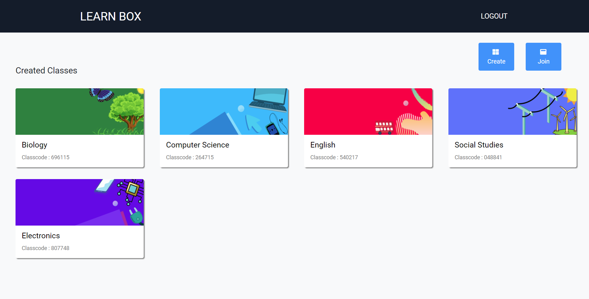

# LearnBox (LMS)- A Clone of Google Classroom

## About The Project
This is a web application which is a similar clone of the Google Classroom application..
Learn-Box helps the students and teachers to communicate with each other, discuss
and share notes..
### Built With
* ### FrontEnd : [GitHub Code](https://github.com/Kabeer279/LearnBox-Frontend)

    FrameWork : [Angular](https://angular.io/) 
    
    IDE : [Visual Code](https://code.visualstudio.com/)
    
* ### Backend : [GitHub Code](https://github.com/Kabeer279/LearnBox-Backend)

    FrameWork : Spring Boot
    
    IDE : [Eclipse](https://www.eclipse.org/)
    
    This project was generated with [Angular CLI](https://github.com/angular/angular-cli) version 10.1.1.

### Screenshots

<!-- CONTACT -->
## Contact
KS AHAMED KABEER 

[LinkedIn](https://www.linkedin.com/public-profile/settings?trk=d_flagship3_profile_self_view_public_profile&lipi=urn%3Ali%3Apage%3Ad_flagship3_profile_self_edit_top_card%3B7ENY2z0sTxGYiKpY8NQTag%3D%3D)

ahamedkabeer279@gmail.com

## Acknowledgements
* Programming with C++ : Sumitha Arora

<!-- MARKDOWN LINKS & IMAGES -->
<!-- https://www.markdownguide.org/basic-syntax/#reference-style-links -->
[contributors-shield]: https://img.shields.io/github/contributors/othneildrew/Best-README-Template.svg?style=for-the-badge
[contributors-url]: https://github.com/othneildrew/Best-README-Template/graphs/contributors
[forks-shield]: https://img.shields.io/github/forks/othneildrew/Best-README-Template.svg?style=for-the-badge
[forks-url]: https://github.com/othneildrew/Best-README-Template/network/members
[stars-shield]: https://img.shields.io/github/stars/othneildrew/Best-README-Template.svg?style=for-the-badge
[stars-url]: https://github.com/othneildrew/Best-README-Template/stargazers
[issues-shield]: https://img.shields.io/github/issues/othneildrew/Best-README-Template.svg?style=for-the-badge
[issues-url]: https://github.com/othneildrew/Best-README-Template/issues
[license-shield]: https://img.shields.io/github/license/othneildrew/Best-README-Template.svg?style=for-the-badge
[license-url]: https://github.com/othneildrew/Best-README-Template/blob/master/LICENSE.txt
[linkedin-shield]: https://img.shields.io/badge/-LinkedIn-black.svg?style=for-the-badge&logo=linkedin&colorB=555
[linkedin-url]: https://linkedin.com/in/othneildrew
[product-screenshot]: images/screenshot.png

## Development server

Run `ng serve` for a dev server. Navigate to `http://localhost:4200/`. The app will automatically reload if you change any of the source files.

## Code scaffolding

Run `ng generate component component-name` to generate a new component. You can also use `ng generate directive|pipe|service|class|guard|interface|enum|module`.

## Build

Run `ng build` to build the project. The build artifacts will be stored in the `dist/` directory. Use the `--prod` flag for a production build.

## Running unit tests

Run `ng test` to execute the unit tests via [Karma](https://karma-runner.github.io).

## Running end-to-end tests

Run `ng e2e` to execute the end-to-end tests via [Protractor](http://www.protractortest.org/).

## Further help

To get more help on the Angular CLI use `ng help` or go check out the [Angular CLI README](https://github.com/angular/angular-cli/blob/master/README.md).
